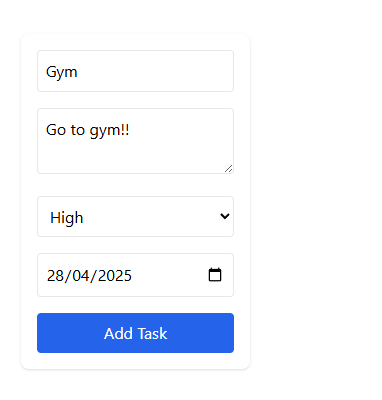
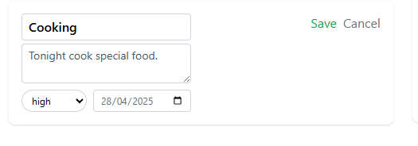

# 📝 TaskMate - Task Management App

## 📌 Overview
TaskMate is a simple yet powerful task management app that helps users efficiently organize and manage their daily tasks. It provides a clean and user-friendly UI with essential features such as task creation, editing, and deletion.

## 📂 Documentation
- [User Personas](docs/userPersonas.md)
- [Use Cases & Scenarios](docs/useCases.md)
- [UI Prototypes](docs/uiPrototypes.md)
- [Information Architecture & Technical Design](docs/architectureDesign.md)
- [Project Management & User Testing](docs/projectManagement.md)
- [Logbook](docs/logbook.md)

# Task Manager 

A full-stack task management application built with **React**, **Express**, and **PostgreSQL**.

##  Features

- **User Authentication**
  - Secure registration and login using JWT
- **Task Management**
  - Create, update, delete tasks
  - Set priority: Low / Medium / High
  - Add due dates
  - Mark tasks as completed
- **Search & Filter**
  - Find tasks by keyword, date, or status
- **Responsive Design**
  - Mobile-friendly UI using Tailwind CSS
- **Notifications**
  - Get reminders for upcoming or overdue tasks

---

##  Tech Stack

| Frontend               | Backend               | Database      | Testing                |
|------------------------|------------------------|---------------|------------------------|
| React                  | Express.js             | PostgreSQL    | Jest                   |
| Tailwind CSS           | Sequelize ORM          |               | React Testing Library  |
| React Router DOM       | JWT Authentication     |               | Supertest              |
| Axios                  | RESTful API            |               |                        |

---

##  Getting Started

###  Prerequisites

- [Node.js](https://nodejs.org/) 
- [PostgreSQL](https://www.postgresql.org/) 
- npm or yarn

---

##  Installation

### 1. Clone the repository

```bash
git clone https://github.com/zprakash/taskmate.git
cd taskmate
```

### 2. Set up environment variables

Create `.env` files for  the `backend/`  directory using the provided `.env.example` template.

---

### 3. Install dependencies

```bash
# Backend
cd backend
npm install

# Frontend
cd ../frontend
npm install
```

---


## Running the App

### Start the backend server

```bash
cd backend
node server.js
```

### Start the frontend development server

```bash
cd frontend
npm run dev
```

Then open [http://localhost:5173](http://localhost:5173) in your browser.

---


---

##  Deployment

### Heroku (Backend)

1. Create a new Heroku app
2. Add PostgreSQL add-on
3. Set config vars from your `.env` file
4. Deploy:

```bash
git push heroku main
```

### Vercel (Frontend)

1. Import your project
2. Set environment variables
3. Deploy!

---

##  Directory Structure

```
task-manager/
├── backend/
│   ├── config/         # Database configuration
│   ├── controllers/    # Route controllers
│   ├── models/         # Sequelize models
│   ├── routes/         # Express routes
│   ├── services/       # Business logic
│   └── app.js          # Express app setup
├── frontend/
│   ├── public/         # Static files
│   └── src/
│       ├── assets/     # Images, fonts
│       ├── components/ # Reusable components
│       ├── pages/      # Page components
│       ├── styles/     # CSS files
│       └── App.js      # Main component
├── .env.example        # Environment variables template
└── README.md
```

---

---
## Screenshots

### Login Screen

*Above: Login screen where users can authenticate to access their tasks.*

### Register Screen

*Above: Register screen for new users to create an account.*

### UI Overview

*Above: General UI showcasing the main layout of the app.*

### Add Task Screen

*Above: Add task screen where users can create new tasks with details.*

### Task List Screen

*Above: Task list screen showing all tasks with their respective status, priority, and due dates.*

### Edit Task Screen

*Above: Edit task screen where users can modify task details.*

---

##  Contributing

Contributions, issues and feature requests are welcome!  
Feel free to check the [issues page](https://github.com/zprakash/taskmate/issues).

---

##  License

This project is licensed under the MIT License.
