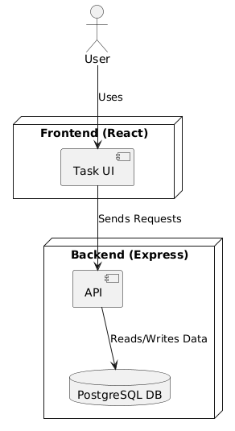
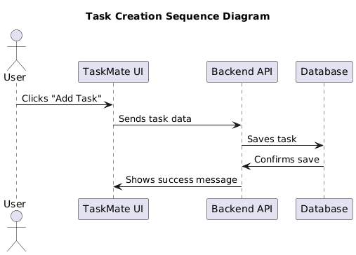
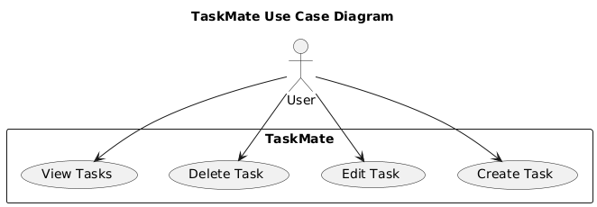

# 🏗️ Information Architecture & Technical Design

## 1️⃣ System Overview
- **Frontend:** React (JavaScript, Tailwind CSS)
- **Backend:** Node.js (Express, JWT Authentication)
- **Database:** PostgreSQL (Hosted on Azure)

## 2️⃣ System Components
- **Users:** Can create, edit, and manage tasks.
- **Tasks:** Stored in a database with priority levels.

## 3️⃣ Architecture Diagram

